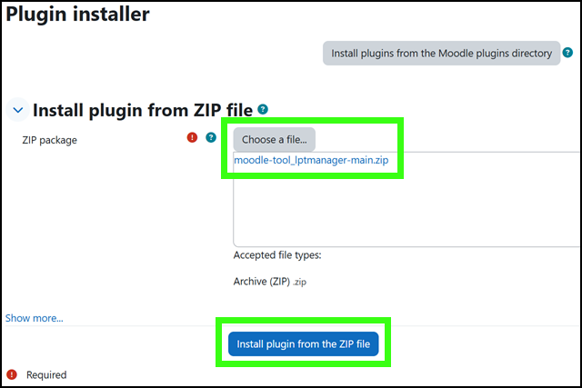
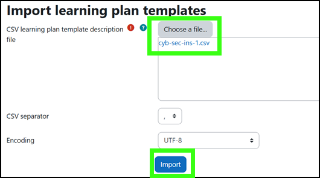
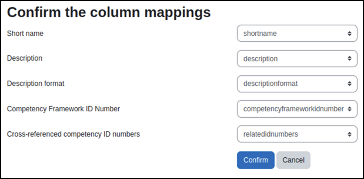

# Learning Plan Template Manager for Moodle 

## Table of Contents

- [Description](#description)
- [Features](#features)
- [Installation](#installation)
- [Usage](#usage)
  - [Importing Learning Plan Templates](#importing-learning-plan-templates)
  - [Exporting Learning Plan Templates](#exporting-learning-plan-templates)
  - [Syncing Learning Plan Templates](#syncing-learning-plan-templates)
- [Future Development](#future-development)
- [Contributing](#contributing)
- [License](#license)

## Description

The **Learning Plan Template (LPT) Manager** is a plugin for Moodle that allows for the import, export, and automatic creation of learning plan templates from a competency framework. This plugin was specifically developed for work roles in the NIST NICE Cybersecurity Framework.

Happy Moodling! 🎓

## Features

The **LPT Manager** plugin in Moodle allows users to:

- Import learning plan templates in CSV format. 
- Export existing learning plan templates for external use.  
- Sync learning plan templates with competency frameworks and automatically create learning plan templates.  

## Installation

System admin-type users or users who have the appropriate permissions should follow the procedures below to download and install the LPT Manager plugin.

1. Download the plugin from this repo.
2. Extract the plugin into the following directory in your Moodle installation:

```
admin/tool/lptmanager
```

-or-

1. Click the green **Code** button and select **Download ZIP**.
2. Log into your Moodle as a site administrator or with the appropriate permissions.
3. Click **Site administration**, **Plugins**, **Install Plugins**.
4. Under **Install plugin from ZIP file**, click **Choose a file...**, then **Choose File**, and **Upload this file** (the **moodle-tool_lptmanager-main.zip** file).
5. Click **Install plugin from the ZIP file** and follow the on-screen instructions to complete the installation, including updating the Moodle database.



## Usage

Once the LPT Manager plugin has been installed, Moodle administrators or Moodle users with the appropriate permissions, can use the plugin.

### Importing learning plan templates

1. In Moodle, navigate to **Site administration**, **Competencies**, **Import learning plan templates**.
2. Click **Choose a file...**, then **Choose File** and **Upload this file** to upload the .CSV learning plan template file.
3. Click **Import**.

   

4. **Confirm** the column mappings.

   

5. Upload a properly formatted .CSV file containing learning plan template data. You will receive a success message: *Learning Plan Templates Imported*. 
6. Click **Continue**. 

### Exporting learning plan templates

1. In Moodle, navigate to **Site administration**, **Competencies**, **Export learning plan templates**.
2. Select a learning plan template from the list of learning plans.
3. Click **Export** and export the one file. Select **Export All Learning Plans** to export all of the available templates instead of just the one.

### Syncing learning plan templates

1. In Moodle, navigate to **Site administration**, **Competencies**, **Sync learning plan templates from competency framework**.
2. Choose a competency framework (e.g., the NICE Workforce Framework) to sync with.
3. For **Competency Name**, enter the competency name or ID (e.g., DD-WRL-001).
4. Click **Sync**.  Confirm the sync. The plugin will add cross-referenced competencies to the selected learning plan template.

### Notes

- **File format**: Ensure .CSV files for import are properly formatted.
- **Existing templates**: If a learning plan template already exists, the system will notify you: `template already exists`.
- **Development status**: Some features (e.g., success confirmation pages for sync) may still be under development.

## Future Development

- A form-based interface to specify regex patterns.
- An approval process to review templates before their creation.
- Reporting features to monitor and manage generated templates.

## Contributing

Contributions are welcome. To report issues, suggest features, or contribute code, please follow the steps below.   

1. Open an issue in the [GitHub Issues](#) section.
2. Create a new branch for your feature or fix.
3. Make your updates.
4. Create and submit your pull request.

## License

Learning Plan Template Manager for Moodle

Copyright 2024 Carnegie Mellon University.

NO WARRANTY. THIS CARNEGIE MELLON UNIVERSITY AND SOFTWARE ENGINEERING INSTITUTE MATERIAL IS FURNISHED ON AN "AS-IS" BASIS. CARNEGIE MELLON UNIVERSITY MAKES NO WARRANTIES OF ANY KIND, EITHER EXPRESSED OR IMPLIED, AS TO ANY MATTER INCLUDING, BUT NOT LIMITED TO, WARRANTY OF FITNESS FOR PURPOSE OR MERCHANTABILITY, EXCLUSIVITY, OR RESULTS OBTAINED FROM USE OF THE MATERIAL. CARNEGIE MELLON UNIVERSITY DOES NOT MAKE ANY WARRANTY OF ANY KIND WITH RESPECT TO FREEDOM FROM PATENT, TRADEMARK, OR COPYRIGHT INFRINGEMENT. Licensed under a GNU GENERAL PUBLIC LICENSE - Version 3, 29 June 2007-style license, please see license.txt or contact permission@sei.cmu.edu for full terms.

[DISTRIBUTION STATEMENT A] This material has been approved for public release and unlimited distribution. Please see Copyright notice for non-US Government use and distribution.

This Software includes and/or makes use of Third-Party Software each subject to its own license.

DM24-1177
